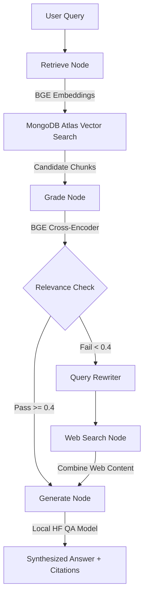

# DocuTrust: Enterprise Advanced RAG Platform with Automated Self-Correction
**Major Project**

DocuTrust is a production-ready, local-first Corrective Retrieval-Augmented Generation (CRAG) platform designed to parsing, index, and query complex corporate document packets securely without data leakage. Basic AI document portals often suffer from hallucinated outputs and unverified responses when querying policy text. DocuTrust addresses this by combining dense vector searches with local cross-encoder grading, real-time node routing, query rewriting, and automated web fallback indexing.

---

## System Architecture Overview

DocuTrust orchestrates an advanced agentic RAG pipeline built with LangGraph:



1. **Document Ingestion (Text Extraction & Vectorization)**: Uploaded PDFs are parsed via `pypdf`, recursively split using `RecursiveCharacterTextSplitter` to preserve sentence boundaries, and mapped to 384-dimensional dense vectors using a local `all-MiniLM-L6-v2` transformer model.
2. **Retrieve Node**: Query vectors are mapped and compared against MongoDB Atlas collections using a `$vectorSearch` aggregation stage. If the vector index is not configured, it falls back to a text keyword search.
3. **Cross-Encoder Grading**: Candidate chunks are re-evaluated against the user's query using the local `BAAI/bge-reranker-base` cross-encoder. It scores token-concatenations, filtering out any passages scoring below a `0.4` relevance threshold.
4. **Automated Web Fallback**: If all chunks fail grading, the query is cleaned by a query-rewriter and sent to Tavily Search API (falling back to DuckDuckGo scraping if Tavily is unavailable).
5. **Synthesis & Citation Mapping**: Documents are passed to a local Question-Answering transformer (`deepset/roberta-base-squad2`) to synthesize an answer. If confidence is low, the pipeline falls back to keyword-sentence summaries, citing source documents and page chunk indices.
6. **LRU Database Management**: The platform limits active indexed document capacity to 5 documents. If a 6th document is uploaded, it evicts the least recently accessed document (based on `last_accessed_at` timestamps updated during RAG queries) and purges its metadata and chunks from the database.

---

## Prerequisites

Ensure you have the following installed and configured before starting:
* **Docker & Docker Compose** (Desktop/Engine v20.10+)
* **MongoDB Atlas Connection string** (or a local MongoDB instance running on port 27017)
* **Tavily Search API Key** (Optional, for web fallback routing queries)

---

## Quick Start Guide

Set up and boot the DocuTrust platform using Docker Compose in 3 steps:

### Step 1: Configure Environment Variables
Create a file named `.env` inside the `backend/` directory and configure your credentials:
```ini
PROJECT_NAME="DocuTrust API"
API_V1_STR="/api/v1"
DEBUG=true
PORT=8000
HOST="0.0.0.0"

# MongoDB Database URI (Local or Atlas)
MONGODB_URL="mongodb+srv://<username>:<password>@cluster.mongodb.net"
MONGODB_DB_NAME="docutrust_db"

# Local AI Models Configuration
EMBEDDING_MODEL_NAME="BAAI/bge-small-en-v1.5"
CROSS_ENCODER_MODEL_NAME="BAAI/bge-reranker-base"

# Web Search API (Optional)
TAVILY_API_KEY="tvly-yourKey"
```

### Step 2: Build and Run Containers
Run the Docker Compose command at the project root to build and pull required layers:
```bash
docker-compose up --build
```
This builds two isolated services:
* `backend`: Serves the FastAPI pipeline on port `8000`.
* `frontend`: Serves the static Nginx dashboard on port `3000`.

### Step 3: Open the Dashboard
Open your browser and navigate to:
```
http://localhost:3000
```
* Status indicators in the top right will display live connections to FastAPI and MongoDB Atlas.
* Drop your PDF files on the left to chunk and embed them, and query the system on the right to trace agent activities and read sourced answers.
